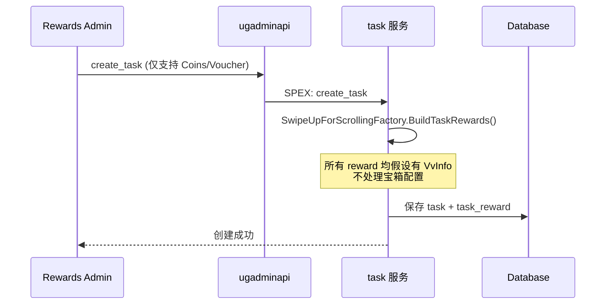
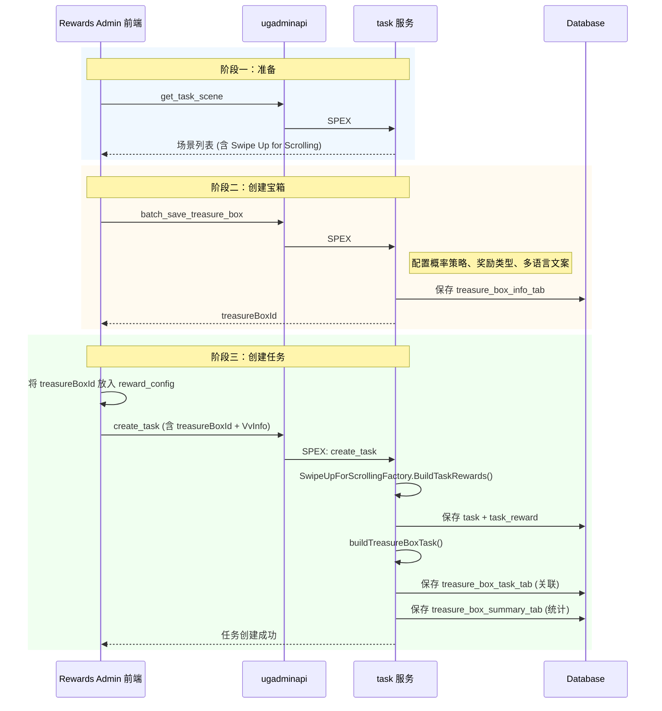
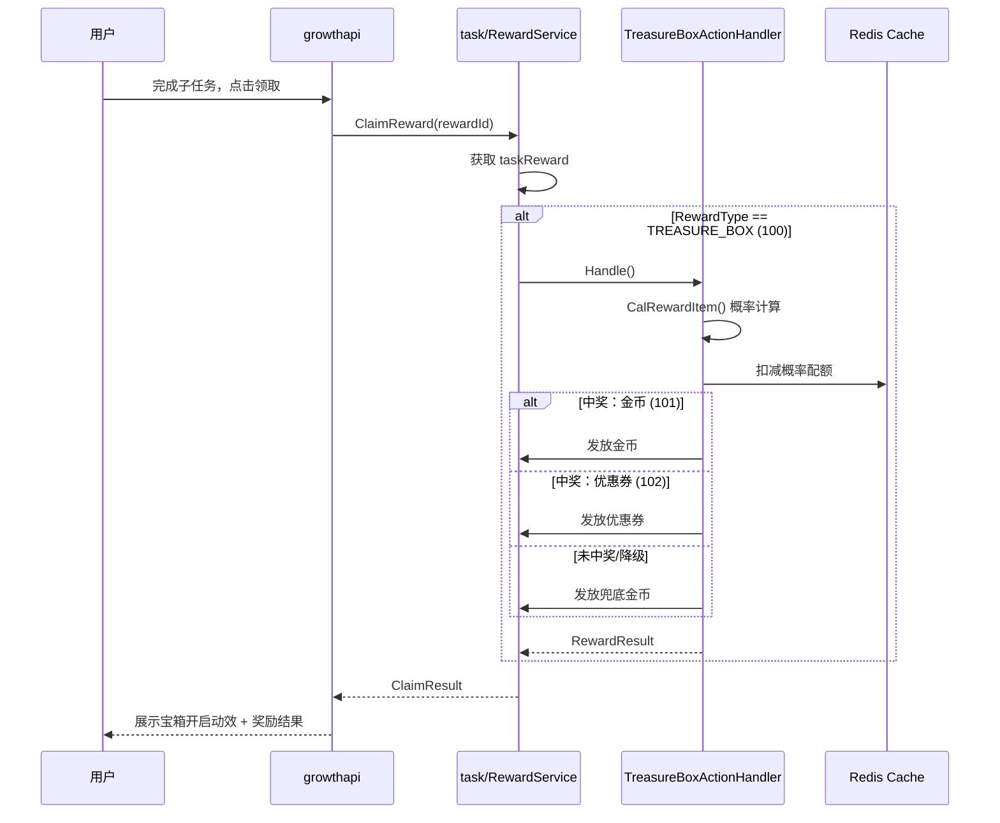
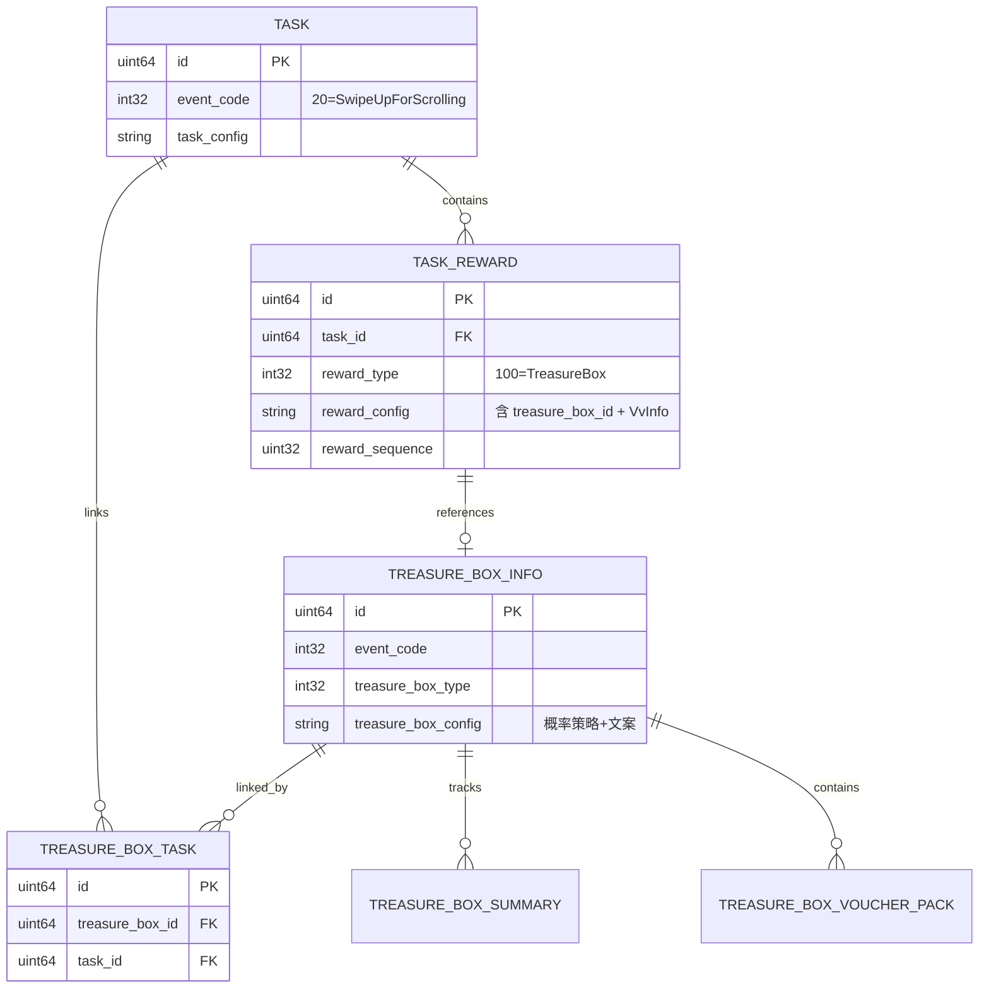

技术设计方案：Swipe Up for Scrolling Task 支持 Treasure Box 奖励
===

[TOC]

## 1. 需求背景

### 1.1 业务背景

ID Local 计划在 2026 年 3 月活动中使用 Swipe Up for Scrolling Task，并希望在该任务中配置 Treasure Box 作为奖励形式。相比现有的 Coins/Voucher 奖励，Treasure Box 采用抽奖机制，能够更好地控制整体预算（用较大的奖励噱头吸引用户，但实际只付出较少成本）。

- B端 PRD: https://confluence.shopee.io/pages/viewpage.action?pageId=3071145603
- C端 PRD: https://confluence.shopee.io/display/SPV/%5BPRD%5Dsupport+adding+treasure+box+as+reward+in+swipe+up+task

### 1.2 现状分析

当前系统中：
- **Watch Task for Scrolling**（EventCode=19）已支持 Treasure Box 配置
- **Swipe Up for Scrolling Task**（EventCode=20）尚不支持 Treasure Box 配置
- 两种任务在 C 端（奖励发放、领取逻辑）大部分代码路径已统一处理
- B 端 Admin 配置层面，Swipe Up for Scrolling 的工厂类和详情返回缺少宝箱处理逻辑

### 1.3 现有奖励类型支持

| 奖励类型 | RewardType | Swipe Up 支持 | Watch Task 支持 |
|---------|-----------|---------------|-----------------|
| Balance (金币) | 1 | 是 | 是 |
| Voucher | 4 | 是 | 是 |
| Treasure Box | 100 | **否** | 是 |

## 2. 需求目标

1. **B端（Rewards Admin）**：支持在 Swipe Up for Scrolling Task 中配置 Treasure Box 作为奖励类型
2. **C端（用户端）**：用户完成 Swipe Up 子任务后可领取宝箱，根据概率获得奖励（Coins/Voucher）
3. **Admin 管理**：Treasure Box List Page 支持按 Swipe Up for Scrolling 场景筛选和展示 "sub-task #N" 位置关联
4. **RN 兼容**：旧版 RN 客户端无法渲染宝箱 UI，需回退为展示和发放 Coin 奖励

## 3. 旧方案流程

### 3.1 当前 Swipe Up for Scrolling 奖励配置流程



### 3.2 Watch for Scrolling 宝箱流程（参照对象）

Watch for Scrolling 已完整支持 Treasure Box，其关键实现点为：
- 工厂 `BuildTaskRewards` 直接 `json.Marshal(reward.RewardConfig)` 序列化完整奖励配置，不依赖特定子字段
- 工厂 `BuildAdminTaskDetail` 中有 `taskRewardDetails` 的处理逻辑
- `get_task_detail_processor` 的 WATCH_FOR_SCROLLING 分支返回完整宝箱字段（TreasureBoxId/Type/Strategy/Texts 等）

## 4. 新方案流程

### 4.1 完整接口调用流程

创建 Swipe Up for Scrolling Task 并配置宝箱奖励需要调用以下接口：

#### 阶段一：准备工作（可选）

| 步骤 | 接口 | 说明 |
|-----|------|------|
| 1 | `luckyvideo.growth.task.get_task_scene` | 获取任务场景列表 |
| 2 | `luckyvideo.growth.task.get_voucher_pack_list` | （如果宝箱含优惠券）获取可用的券包列表 |

#### 阶段二：创建宝箱（必须）

| 步骤 | 接口 | 说明 |
|-----|------|------|
| 3 | `luckyvideo.growth.task.batch_save_treasure_box` | 创建宝箱配置，返回 `treasureBoxId` |

#### 阶段三：创建任务（必须）

| 步骤 | 接口 | 说明 |
|-----|------|------|
| 4 | `luckyvideo.growth.task.check_task_voucher` | （可选）校验任务券配置 |
| 5 | `luckyvideo.growth.task.create_task` | 创建任务，将 `treasureBoxId` 放入 `RewardConfig` |

#### 阶段四：后续管理（可选）

| 步骤 | 接口 | 说明 |
|-----|------|------|
| 6 | `luckyvideo.growth.task.get_task_detail` | 查询任务详情（含宝箱配置） |
| 7 | `luckyvideo.growth.task.update_task_v2` | 更新任务 |
| 8 | `luckyvideo.growth.task.query_treasure_box_summary_list` | 查询宝箱发放统计 |

### 4.2 B端配置流程图



### 4.3 C端领取流程



### 4.4 数据模型关系



## 5. 模块依赖

### 5.1 内部模块依赖

| 工程 | 模块 | 改动类型 | 改动说明 |
|-----|------|---------|---------|
| **task** | `backadmin/service/swipe_up_for_scrolling_factory.go` | **修改** | BuildAdminTaskDetail 补齐 taskRewardDetail、BuildTaskRewardDetails 生成兜底记录、BuildTaskRewards 设置 CheckRewardDetail |
| **ugadminapi** | `handler/growthReward/create_task_processor.go` | **修改** | SWIPE_UP_FOR_SCROLLING 分支补齐 TaskRewardDetail 透传 |
| **ugadminapi** | `handler/growthReward/get_task_detail_processor.go` | **修改** | SWIPE_UP_FOR_SCROLLING 分支返回宝箱字段 |
| **ugadminapi** | `handler/growthReward/export_treasure_box_summary_processor.go` | **修改** | eventSequenceName 增加 EventCode 19/20 映射 |
| **task** | `config/task_switch_config.go` | **修改** | 新增 MinSwipeUpForScrollingTreasureBoxRn CC 配置字段 |
| task | `backadmin/service/treasure_box_service.go` | 无改动 | 已通用支持 |
| task | `backadmin/service/task_service.go` | 无改动 | `buildTreasureBoxTask` 已通用 |
| task | `backadmin/processor/treasure_box_processor.go` | 无改动 | `BatchSaveTreasureBox` 已存在 |
| task | `service/reward_service.go` | 无改动 | 已支持 SWIPE_UP + TREASURE_BOX |
| task | `plugin/action/action_treasure_box.go` | 无改动 | 宝箱发奖逻辑通用 |
| task | `service/task_assemble_service.go` | 无改动 | ClaimTaskRewardAssembleProcessor 已在列表中 |
| growthapi | `service/video_and_merge_reward.go` | 无改动 | 已通过 reward_type + reward_text_info 支持 |
| ugreward | `service/task_service.go` | 无改动 | 已透传宝箱数据 |
| growthprotocol | `task.proto` | 无改动 | 枚举值已定义 |

### 5.2 外部模块依赖

| 依赖方 | 依赖说明 | 影响 |
|-------|---------|------|
| Rewards Admin 前端 | 需支持 Swipe Up 任务配置宝箱 UI | 前端需同步开发 |
| Rewards Admin 前端 | Treasure Box List Page 增加 task scene 筛选项 | 前端需同步开发 |
| C端 RN/Native | 宝箱展示、开启动效、结果弹窗 | 前端需同步开发 |

### 5.3 接口依赖说明

本次后端改动**不新增接口**，复用现有接口：

| 接口 | 是否需要改动 | 说明 |
|-----|------------|------|
| `batch_save_treasure_box` | 否 | 已支持所有 EventCode |
| `create_task` | 否（内部 processor + 工厂改动） | processor 补齐 TaskRewardDetail 透传，工厂改动使其正确处理宝箱 |
| `update_task_v2` | 否（内部 processor + 工厂改动） | 同上 |
| `get_task_detail` | 否（内部返回改动） | 工厂类 + processor 改动使其返回宝箱详情 |
| `query_treasure_box_summary_list` | 否 | 已支持按 task_scene 筛选 |

### 5.4 无需改动模块的关键证据

以下模块已天然支持 Swipe Up for Scrolling + Treasure Box，无需修改：

| 文件 | 已支持原因 |
|-----|-----------|
| `task/service/reward_service.go` | 第 267-268 行已对 SWIPE_UP_FOR_SCROLLING 处理 claim record 缓存 |
| `task/service/reward_service.go` | 第 760 行 buildSendStatus 已对 SWIPE_UP_FOR_SCROLLING + DISTRIBUTE_TYPE_CLAIM 返回 STATE_INIT |
| `task/biz/reward_biz.go` | commonTaskClaimProcessor 已统一处理两种 scrolling 任务的 claim |
| `task/service/task_assemble_service.go` | 第 118-126 行 SWIPE_UP_FOR_SCROLLING 的 processor 列表已含 claimTaskRewardAssembleProcessor |
| `task/backadmin/service/comm_task_factory.go` | BuildTaskRewardDistributeType 已将 REWARD_TYPE_TREASUREBOX 设为 DISTRIBUTE_TYPE_CLAIM |
| `task/backadmin/service/task_service.go` | `buildTreasureBoxTask` 通用于所有任务 |
| `task/convert/task_convert.go` | 第 209-211 行已处理 SWIPE_UP_FOR_SCROLLING 的 config |
| `growthapi/service/video_and_merge_reward.go` | 第 79-83 行已统一处理两种 scrolling 任务，C端通过 reward_type=100 + reward_text_info 识别宝箱 |
| `ugadminapi/.../create_task_processor.go` | 第 235-238 行通用逻辑已设置 TreasureBoxId；但 TaskRewardDetail 需补齐（见改动点 2） |

## 6. 详细改动方案

### 6.1 改动总览

| 序号 | 工程 | 文件 | 改动说明 |
|------|------|------|---------|
| 1 | task | `backadmin/service/swipe_up_for_scrolling_factory.go` | BuildAdminTaskDetail 补齐 taskRewardDetail；BuildTaskRewardDetails 生成兜底记录；BuildTaskRewards 设置 CheckRewardDetail |
| 2 | ugadminapi | `handler/growthReward/create_task_processor.go` | SWIPE_UP_FOR_SCROLLING 分支补齐 TaskRewardDetail 透传 |
| 3 | ugadminapi | `handler/growthReward/get_task_detail_processor.go` | SWIPE_UP_FOR_SCROLLING 分支返回宝箱配置 |
| 4 | ugadminapi | `handler/growthReward/export_treasure_box_summary_processor.go` | eventSequenceName 增加 EventCode 19/20 映射 |
| 5 | task | `config/task_switch_config.go` | 新增 MinSwipeUpForScrollingTreasureBoxRn CC 配置 |

### 6.2 改动点 1：task - swipe_up_for_scrolling_factory.go

本改动点涉及 3 个方法的修改，核心目标是让 Swipe Up for Scrolling 支持宝箱奖励的兜底配置（RN 兼容）。

#### 6.2.1 BuildTaskRewardDetails - 生成 RN 兜底 TaskRewardDetail 记录

**问题**：当前 `BuildTaskRewardDetails` 直接返回空切片，不生成任何 `TaskRewardDetail` 记录。当 Admin 配置宝箱奖励并指定 coin 兜底方案时，无法将兜底信息持久化到 `task_reward_detail_tab`，导致旧版 RN 无法触发奖励替换机制。

**现状代码**（第 31-38 行）：

```31:38:task/internal/backadmin/service/swipe_up_for_scrolling_factory.go
func (d *SwipeUpForScrollingServiceImpl) BuildTaskRewardDetails(
	ctx context.Context,
	reward *entity2.TaskReward,
	taskReward *luckyvideo_growth_task.BackAdminTaskReward,
	rewards []*entity2.TaskReward,
) (taskRewardDetails []*entity2.TaskRewardDetail, err error) {
	return []*entity2.TaskRewardDetail{}, err
}
```

**参照对象**（`swipe_up_task_factory.go` 第 28-75 行，SwipeUp 任务已使用 TaskRewardDetail + ReplaceRule DSL）：

```46:46:task/internal/backadmin/service/swipe_up_task_factory.go
		ReplaceRule:       "{\"processor_list\":[\"vvRewardIdInReplaceList\"],\"condition\":\"vvRewardIdInReplaceList == true\"}",
```

**改动**：当 admin 请求包含 `TaskRewardDetail`（兜底配置）时，生成一条 `task_reward_detail_tab` 记录，`ReplaceRule` 使用 `rn_version` DSL processor 判断客户端版本：

```go
func (d *SwipeUpForScrollingServiceImpl) BuildTaskRewardDetails(
	ctx context.Context,
	reward *entity2.TaskReward,
	taskReward *luckyvideo_growth_task.BackAdminTaskReward,
	rewards []*entity2.TaskReward,
) (taskRewardDetails []*entity2.TaskRewardDetail, err error) {
	if taskReward.GetTaskRewardDetail() == nil {
		return []*entity2.TaskRewardDetail{}, nil
	}

	adminDetail := taskReward.GetTaskRewardDetail()
	minRnVersion := config.GetTaskSwitchConfig(ctx).MinSwipeUpForScrollingTreasureBoxRn

	rewardConfigData := &luckyvideo_growth_task.RewardConfig{}
	if err := json.Unmarshal([]byte(reward.RewardConfig), rewardConfigData); err != nil {
		return nil, err
	}
	fallbackConfig := &luckyvideo_growth_task.RewardConfig{
		VvInfo: rewardConfigData.GetVvInfo(),
	}
	fallbackConfigBytes, _ := json.Marshal(fallbackConfig)

	replaceRule := fmt.Sprintf(
		`{"processor_list":["rn_version"],"condition":"rn_version < %d"}`,
		minRnVersion,
	)

	var replaceRuleConfigStr string
	if len(adminDetail.GetReplaceRuleConfig()) > 0 {
		replaceRuleConfigBytes, _ := json.Marshal(adminDetail.GetReplaceRuleConfig()[0])
		replaceRuleConfigStr = string(replaceRuleConfigBytes)
	}

	detail := &entity2.TaskRewardDetail{
		RewardId:          reward.ID,
		TaskId:            reward.TaskID,
		RewardType:        int32(adminDetail.GetRewardType()),
		Amount:            int32(adminDetail.GetAmount()),
		DistributeType:    int32(luckyvideo_growth_task.Constant_TASK_REWARD_DISTRIBUTE_TYPE_CLAIM),
		Rule:              reward.Rule,
		RewardConfig:      string(fallbackConfigBytes),
		ReplaceRule:       replaceRule,
		ReplaceRuleConfig: replaceRuleConfigStr,
		Ctime:             dsutil.GetMillisecond(),
		Mtime:             dsutil.GetMillisecond(),
	}

	return []*entity2.TaskRewardDetail{detail}, nil
}
```

**关键说明**：

- `ReplaceRule` 使用已注册的 `rn_version` DSL processor（`dsl_service.go` 第 71 行），当 `rn_version < MinSwipeUpForScrollingTreasureBoxRn` 时命中替换
- `RewardConfig` 仅保留 `VvInfo`（完成条件不变），移除宝箱字段
- `RewardType` = BALANCE (1)，`Amount` = admin 配置的兜底金币数
- 阈值 `MinSwipeUpForScrollingTreasureBoxRn` 从 CC Config 读取，创建任务时写入 DSL

#### 6.2.2 BuildTaskRewards - 设置 CheckRewardDetail 标志

**问题**：当前 `CheckRewardDetail` 硬编码为 0，导致 task 服务在组装任务列表时不会查询 `task_reward_detail_tab`，ReplaceRule DSL 无法生效。

**现状代码**（第 210 行）：

```210:210:task/internal/backadmin/service/swipe_up_for_scrolling_factory.go
		taskReward.CheckRewardDetail = 0
```

**改动**：当 admin 请求包含 `TaskRewardDetail`（即配置了兜底方案）时，设置 `CheckRewardDetail = 1`：

```go
		if taskReward.GetTaskRewardDetail() != nil {
			taskReward.CheckRewardDetail = 1
		} else {
			taskReward.CheckRewardDetail = 0
		}
```

**运行时效果**（`task_service.go` 第 560-593 行已有通用逻辑，无需改动）：

```560:593:task/internal/service/task_service.go
		// CheckRewardDetail == 1 时，收集需要检查的 rewardId
		if taskReward.CheckRewardDetail == constant.CHECK_TASK_REWARD_DETAIL_TRUE {
			checkRewardDetailIds = append(checkRewardDetailIds, taskReward.ID)
		}
		// ...
		// 加载 TaskRewardDetail，评估 ReplaceRule DSL
		// 若 rn_version < 阈值，覆盖 RewardType/Amount/RewardConfig 等字段
		rewardDetail, ok := rewardId2TaskRewardDetailMap[reward.ID]
		if ok {
			reward.RewardType = rewardDetail.RewardType    // BALANCE
			reward.Amount = rewardDetail.Amount            // 兜底金币
			reward.RewardConfig = rewardDetail.RewardConfig // 仅含 VvInfo
		}
```

#### 6.2.3 BuildAdminTaskDetail - 补齐 taskRewardDetail 处理

**问题**：当前 `SwipeUpForScrollingServiceImpl.BuildAdminTaskDetail` 缺少 `taskRewardDetails` 的处理逻辑，而 `WatchForScrollingServiceImpl.BuildAdminTaskDetail` 已包含。这导致 Admin 查看含宝箱的任务时无法看到兜底配置。

**参照对象**（`watch_for_scrolling_factory.go` 第 90-96 行）：

```90:96:task/internal/backadmin/service/watch_for_scrolling_factory.go
		if len(taskRewardDetails) > 0 {
			currDetail, err := BuildAdminTaskRewardDetails(reward, taskRewardDetails)
			if err != nil {
				return nil, err
			}
			adminReward.TaskRewardDetail = currDetail
		}
```

**改动**：在 `SwipeUpForScrollingServiceImpl.BuildAdminTaskDetail` 的 `adminTaskRewards = append(adminTaskRewards, adminReward)` 之前，增加相同的 taskRewardDetail 处理：

```go
		if len(taskRewardDetails) > 0 {
			currDetail, err := BuildAdminTaskRewardDetails(reward, taskRewardDetails)
			if err != nil {
				return nil, err
			}
			adminReward.TaskRewardDetail = currDetail
		}

		adminTaskRewards = append(adminTaskRewards, adminReward)
```

### 6.3 改动点 2：ugadminapi - create_task_processor.go

#### 6.3.1 buildCreateTaskRewards - 补齐 TaskRewardDetail 透传

**问题**：当前 `SWIPE_UP_FOR_SCROLLING_EVENT` 分支仅设置 `VvInfo`，没有处理 `TaskRewardDetail`。而 `WATCH_FOR_SCROLLING_EVENT` 分支包含完整的 `TaskRewardDetail` 透传逻辑。这导致 Admin 前端配置宝箱替换规则（低版本兜底奖励）时，数据在 create/update 流程中丢失，无法传递给 task 服务存储。

**现状代码**（第 232-234 行）：

```232:234:ugadminapi/internal/handler/growthReward/create_task_processor.go
		} else if task.EventCode == int32(luckyvideo_growth_task.Constant_SWIPE_UP_FOR_SCROLLING_EVENT) {
			rewardConfig.VvInfo = taskReward.RewardConfig.VVInfo
		}
```

**参照对象**（WATCH_FOR_SCROLLING 分支，第 201-231 行）：

```201:231:ugadminapi/internal/handler/growthReward/create_task_processor.go
		} else if task.EventCode == int32(luckyvideo_growth_task.Constant_WATCH_FOR_SCROLLING_EVENT) {
			rewardConfig.CompleteStrategy = &luckyvideo_growth_task.CompleteStrategy{
				Duration: proto.Int32(taskReward.RewardConfig.CompleteStrategy.Duration),
			}
			if taskReward.TaskRewardDetail != nil {
				taskRewardDetail.RewardType = proto.Uint64(taskReward.TaskRewardDetail.RewardType)
				taskRewardDetail.RewardName = proto.String(taskReward.TaskRewardDetail.RewardName)
				taskRewardDetail.RewardSequence = proto.Uint64(
					taskReward.TaskRewardDetail.RewardSequence,
				)
				// ... Amount, ReplaceRuleConfigs 处理
			}
		}
```

**改动**：在 `SWIPE_UP_FOR_SCROLLING_EVENT` 分支中补充 `TaskRewardDetail` 处理：

```go
		} else if task.EventCode == int32(luckyvideo_growth_task.Constant_SWIPE_UP_FOR_SCROLLING_EVENT) {
			rewardConfig.VvInfo = taskReward.RewardConfig.VVInfo
			if taskReward.TaskRewardDetail != nil {
				taskRewardDetail.RewardType = proto.Uint64(taskReward.TaskRewardDetail.RewardType)
				taskRewardDetail.RewardName = proto.String(taskReward.TaskRewardDetail.RewardName)
				taskRewardDetail.RewardSequence = proto.Uint64(
					taskReward.TaskRewardDetail.RewardSequence,
				)
				amount, err := coinconvert.ConvertCoins2Amount(
					ctx,
					taskReward.TaskRewardDetail.Coins,
				)
				if err != nil {
					return nil, err
				}
				taskRewardDetail.Amount = proto.Uint64(amount)
				if taskReward.TaskRewardDetail.ReplaceRuleConfigs != nil {
					replaceRuleConfigs := make([]*luckyvideo_growth_task.ReplaceRuleConfig, 0)
					for _, config := range taskReward.TaskRewardDetail.ReplaceRuleConfigs {
						replaceRuleConfig := &luckyvideo_growth_task.ReplaceRuleConfig{}
						replaceRuleConfig.Processor = proto.String(config.Processor)
						replaceRuleConfig.Operator = proto.String(config.Operator)
						replaceRuleConfig.Key = proto.String(config.Key)
						replaceRuleConfig.Value = proto.String(config.Value)
						replaceRuleConfigs = append(replaceRuleConfigs, replaceRuleConfig)
					}
					taskRewardDetail.ReplaceRuleConfig = replaceRuleConfigs
				}
			}
		}
```

### 6.4 改动点 3：ugadminapi - get_task_detail_processor.go

**问题**：当前 SWIPE_UP_FOR_SCROLLING 分支仅返回 `VVInfo`，缺失宝箱相关字段。运营在查看/编辑含宝箱的 Swipe Up 任务时，无法看到宝箱关联信息（包括 TreasureBoxId），前端无法展示宝箱配置。

**现状代码**（第 363-367 行）：

```363:367:ugadminapi/internal/handler/growthReward/get_task_detail_processor.go
		} else if adminTask.GetEventCode() == int32(luckyvideo_growth_task.Constant_SWIPE_UP_FOR_SCROLLING_EVENT) {
			rewardConfig := &entity.RewardConfig{}
			rewardConfig.VVInfo = taskReward.GetRewardConfig().GetVvInfo()
			adminTaskReward.RewardConfig = rewardConfig
		}
```

**参照对象**（WATCH_FOR_SCROLLING 分支，第 335-362 行）：

```335:362:ugadminapi/internal/handler/growthReward/get_task_detail_processor.go
		} else if adminTask.GetEventCode() == int32(luckyvideo_growth_task.Constant_WATCH_FOR_SCROLLING_EVENT) {
			rewardConfig := &entity.RewardConfig{}
			rewardConfig.CompleteStrategy = &entity.CompleteStrategy{
				Duration: taskReward.GetRewardConfig().GetCompleteStrategy().GetDuration(),
			}
			// ... 宝箱配置完整返回
			rewardConfig.TreasureBoxType = taskReward.GetRewardConfig().GetTreasureBoxType()
			rewardConfig.TreasureBoxTexts = taskReward.GetRewardConfig().GetTreasureBoxTexts()
			rewardConfig.TreasureBoxId = taskReward.GetRewardConfig().GetTreasureBoxId()
			rewardConfig.TreasureBoxExternalId = taskReward.GetRewardConfig().GetTreasureBoxExternalId()
			// ...
		}
```

**改动**：在 SWIPE_UP_FOR_SCROLLING 分支中补充宝箱字段返回：

```go
		} else if adminTask.GetEventCode() == int32(luckyvideo_growth_task.Constant_SWIPE_UP_FOR_SCROLLING_EVENT) {
			rewardConfig := &entity.RewardConfig{}
			rewardConfig.VVInfo = taskReward.GetRewardConfig().GetVvInfo()

			if len(taskReward.GetRewardConfig().GetTreasureBoxStrategy()) > 0 {
				treasureStrategy, err := buildTreasureBoxStrategy(
					ctx,
					taskReward.GetRewardConfig().GetTreasureBoxStrategy(),
				)
				if err != nil {
					return nil, err
				}
				rewardConfig.TreasureBoxStrategy = treasureStrategy
			}
			rewardConfig.TreasureBoxType = taskReward.GetRewardConfig().GetTreasureBoxType()
			rewardConfig.TreasureBoxTexts = taskReward.GetRewardConfig().GetTreasureBoxTexts()
			rewardConfig.TreasureBoxId = taskReward.GetRewardConfig().GetTreasureBoxId()
			rewardConfig.TreasureBoxExternalId = taskReward.GetRewardConfig().
				GetTreasureBoxExternalId()
			adminTaskReward.RewardConfig = rewardConfig

			taskRewardDetail, err := buildTaskRewardDetail(ctx, taskReward)
			if err != nil {
				return nil, err
			}
			adminTaskReward.TaskRewardDetail = taskRewardDetail
		}
```

### 6.5 改动点 4：ugadminapi - export_treasure_box_summary_processor.go

**问题**：`eventSequenceName` 缺少 WATCH_FOR_SCROLLING_EVENT（EventCode=19）和 SWIPE_UP_FOR_SCROLLING_EVENT（EventCode=20）的映射，导致宝箱 Summary 导出时 Location 列无法正确显示子任务序号。PRD 要求 Swipe Up 任务显示 "sub-task #N"。

**现状代码**（第 24-28 行）：

```24:28:ugadminapi/internal/handler/growthReward/export_treasure_box_summary_processor.go
var (
	eventSequenceName = map[int32]string{
		1: "Day ",
		2: "Circle #",
	}
```

**改动**：增加 EventCode 19 和 20 的映射：

```go
var (
	eventSequenceName = map[int32]string{
		1:  "Day ",
		2:  "Circle #",
		19: "Circle #",
		20: "sub-task #",
	}
```

### 6.6 改动点 5：task - config/task_switch_config.go

**问题**：需要一个可热更新的 CC 配置来控制 Swipe Up for Scrolling 任务展示宝箱所需的最低 RN 版本。当所有客户端版本均已支持宝箱后，调高此阈值即可关闭兜底逻辑。

**改动**：在 `TaskSwitchConfig` 结构体中新增字段：

```go
type TaskSwitchConfig struct {
	// ... existing fields ...
	MinSwipeUpForScrollingTreasureBoxRn int64 `json:"min_swipe_up_for_scrolling_treasure_box_rn"`
}
```

**CC 配置示例**（`lucky_video_task_switch_config`）：

```json
{
  "min_swipe_up_for_scrolling_treasure_box_rn": 1740000000000
}
```

> 注：RN 版本号为毫秒级时间戳格式（如 `1740000000000` 对应 2025-02-20），需根据实际发版时间设置。

## 7. 改动风险点

### 7.1 风险识别

| 风险点 | 风险等级 | 影响范围 | 缓解措施 |
|-------|---------|---------|---------|
| get_task_detail 返回字段变更 | 低 | Admin 详情页展示 | 新增字段为 omitempty / 零值安全，不影响现有 Coins/Voucher 奖励 |
| 宝箱概率配置错误 | 中 | 预算超支 | Admin 端已有概率总和校验（复用现有逻辑） |
| 奖励发放失败 | 中 | 用户体验 | 已有兜底金币机制（action_treasure_box.go） |
| 前后端接口不兼容 | 低 | 功能不可用 | 复用现有宝箱接口定义，不新增接口 |
| 旧 RN 客户端展示宝箱 | 中 | 用户无法领取 | TaskRewardDetail + ReplaceRule DSL 自动替换为 Coin；CC 配置控制版本阈值 |
| CC 配置 MinRn 设置不当 | 低 | 兜底不生效或误触发 | 根据实际发版 RN 版本号设置，灰度验证 |

### 7.2 兼容性分析

1. **协议兼容**：无需新增 proto 字段，复用现有 `REWARD_TYPE_TREASUREBOX = 100`
2. **数据库兼容**：复用现有表结构（treasure_box_info_tab、treasure_box_task_tab、task_reward_detail_tab 等）
3. **接口兼容**：Admin 端 CreateTask/UpdateTask/GetTaskDetail 接口无需修改签名
4. **C端兼容**：新版 RN 通过 `reward_type` 和 `reward_text_info` 识别宝箱；旧版 RN 通过 TaskRewardDetail 替换机制自动降级为 Coin，无需 growthapi 改动
5. **RN 版本控制**：`MinSwipeUpForScrollingTreasureBoxRn` CC 配置支持热更新，全量升级后调整阈值即可关闭兜底

### 7.3 回滚方案

改动仅涉及 5 个文件的逻辑增强，若出现问题：
1. 回滚代码至改动前版本
2. 已创建的含宝箱的 Swipe Up 任务可通过 Admin 修改为 Coins/Voucher 奖励
3. RN 兼容问题可通过调整 `MinSwipeUpForScrollingTreasureBoxRn` CC 配置热修复（设为极大值使所有客户端都走兜底）

## 8. 测试要点

### 8.1 单元测试

- `SwipeUpForScrollingServiceImpl.BuildTaskRewardDetails`：宝箱奖励含 TaskRewardDetail 时正确生成兜底记录
- `SwipeUpForScrollingServiceImpl.BuildTaskRewards`：宝箱奖励的 `CheckRewardDetail` 为 1；非宝箱奖励为 0
- `SwipeUpForScrollingServiceImpl.BuildAdminTaskDetail`：含宝箱奖励时正确返回 taskRewardDetail
- `create_task_processor.buildCreateTaskRewards`：SWIPE_UP_FOR_SCROLLING + TaskRewardDetail 透传
- `get_task_detail_processor.buildTaskRewards`：SWIPE_UP_FOR_SCROLLING + TREASURE_BOX 场景
- `eventSequenceName` 映射正确性（EventCode 19/20）

### 8.2 集成测试

| 测试场景 | 预期结果 |
|---------|---------|
| 调用 `batch_save_treasure_box` 创建宝箱 | 成功返回 treasureBoxId |
| 调用 `create_task` 创建含宝箱的 Swipe Up 任务（含兜底配置） | 成功创建，treasure_box_task_tab 有关联记录，task_reward_detail_tab 有兜底记录 |
| 调用 `get_task_detail` 查询含宝箱的 Swipe Up 任务 | 正确返回宝箱配置（TreasureBoxId/Type/Texts） |
| 调用 `update_task_v2` 修改宝箱配置 | 正确更新 |
| C端用户完成子任务领取宝箱 | 根据概率获得奖励 |
| 创建混合奖励任务（部分子任务用 Coins，部分用 TreasureBox） | 两种奖励类型均正常工作 |
| 调用 `query_treasure_box_summary_list` 按场景筛选 | 能筛选出 Swipe Up for Scrolling 场景（task_scene="20-1"/"20-3"） |
| 导出 Treasure Box Summary | Location 列正确显示 "sub-task #N" |
| 旧版 RN 请求含宝箱的 Swipe Up 任务列表 | 任务列表中宝箱奖励被替换为 Coin（RewardType=1），金额为兜底配置值 |
| 新版 RN 请求含宝箱的 Swipe Up 任务列表 | 任务列表中正常展示宝箱奖励（RewardType=100） |
| 旧版 RN 领取被替换的 Coin 奖励 | 正常发放 Coin |

## 9. 总结

本次需求改动范围可控，核心改动集中在 **5 个文件**。功能开发参照已有的 Watch for Scrolling 实现，RN 兼容方案复用已有的 `TaskRewardDetail` + `ReplaceRule` DSL 机制。C端发奖、领取逻辑已统一支持，growthapi 无需额外改动。

**后端改动量**：
- 文件数：5 个
- 代码行数：约 100 行

| 改动文件 | 改动说明 |
|---------|---------|
| `task/.../swipe_up_for_scrolling_factory.go` | BuildTaskRewardDetails 生成兜底记录 + BuildTaskRewards 设置 CheckRewardDetail + BuildAdminTaskDetail 补齐 taskRewardDetail |
| `ugadminapi/.../create_task_processor.go` | SWIPE_UP_FOR_SCROLLING 分支补齐 TaskRewardDetail 透传 |
| `ugadminapi/.../get_task_detail_processor.go` | SWIPE_UP_FOR_SCROLLING 分支返回宝箱配置字段 |
| `ugadminapi/.../export_treasure_box_summary_processor.go` | eventSequenceName 增加 EventCode 19/20 映射 |
| `task/.../config/task_switch_config.go` | 新增 MinSwipeUpForScrollingTreasureBoxRn CC 配置 |

**前端改动**（不在本次后端范围）：
- Admin UI：Swipe Up 任务配置页面支持选择宝箱奖励 + 配置 Coin 兜底方案
- Admin UI：Treasure Box List Page 增加 task scene 筛选
- C端 RN/Native：宝箱展示、开启动效、结果弹窗

---

**文档版本**

| 版本 | 日期 | 更新内容 | 编写人 |
|-----|------|---------|-------|
| 1.0 | 2026-02-04 | 创建技术设计文档 | - |
| 2.0 | 2026-02-27 | 整合两版方案，补充 create_task_processor / get_task_detail_processor / export_summary 改动 | - |
| 3.0 | 2026-02-27 | 新增 RN 兼容方案（TaskRewardDetail + ReplaceRule DSL + CC Config） | - |
